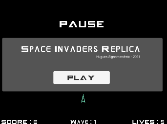
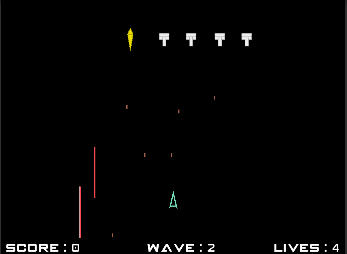

# unity-space-invaders
Game made with Unity in a exam context.

## Game overview

This game is a replica of the famous Space Invaders game.
In this game, you control a spaceship able to blast lasers, nothing less.
It is quite convenient because the space is filled with other beings, and lasers are a good way to deal with 'em.
Be careful thought, some lads won't be happy with you firing at them and they will backfire !
The more ships you destroy, the more points you earn ( but think about all the lives you selfishly took you monster ! )

### Game mechanics

The gas pedal of your ship is broken, allowing your ship only to move right and left.
A press on the fire button will shoot a laser in front of the ship, destroying the first target on its way.
Enemies will appear on screen, and as they are social, always with friends, never alone.
The last enemy of the wave will drop a pill into space. Whether it contains a bonus for your ship or his last words about how he and his friends got murdered by a destruction-mad space gunner, it's better to collect it.

### UML

GameManager :

	Player : GameObject
	EnemyWave : GameObject
	lives : Integer to store the remainings lives of the player
	score : Integer to store the score of the player

Player :

	speed : Float
	laser : GameObject that the ship can Instantiate
	power : String which specify the power type the player currently has, none if no active power
	Fire() : Instanciate a laser
	Move() : Move left or right according to the pressed key
	Power() : If the player has a power enabled, pressing the right key will use it.

EnemyBasic :

	Fire(): Fire a straight forward bullet
	OnTriggerEnter2D: Destroy and add points
	Move()

EnemyBeam :

	Fire() : Fire a laser all longer than the others
	Move()

EnemyWave :
	Each wave, 5 enemies are created. It can be any type of Enemy listed in the enemiesTypes array.

	List<GameObject> enemies : Array of Enemy
	List<GameObject> enemiesTypes: All kind of enemy
	dropX, dropY: Coordinates of the last enemy in the wave, needed to drop the bonus at the right place.
	SelectWaveType() : Select the type of wave.
	InstanciateBonus() : Drop a pill when the last enemy dies

BonusManager :
The bonus manager is instantiated when the last enemy of a wave is killed. It has a reference to every bonus type and will randomly select one of the bonuses and make it spawn.

	speed : Speed of the falling bonus
	List<GameObject> types : 
	
